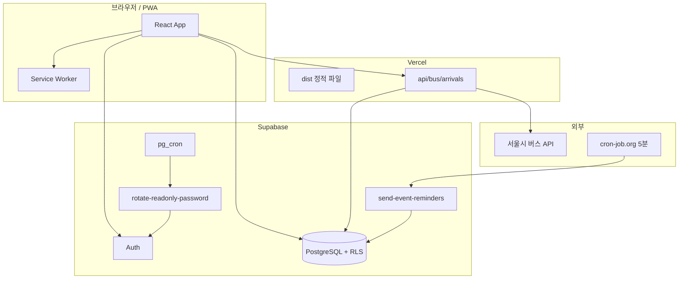

# 기능 개요

개인 대시보드에 추가·변경된 주요 기능 정리입니다. (2026-06 기준)

---

## 페이지 구성

| 경로 | 로그인 | 설명 |
|------|--------|------|
| `/` | 불필요 | About — 프로필·프로젝트 |
| `/home` | 필요 | 홈 — 오늘 일정·가계부·버스 요약 |
| `/dashboard` | 필요 | FullCalendar 일정 관리 |
| `/ledger` | 필요 | 가계부 (수입·지출·예산·고정 항목) |
| `/bus` | 불필요 | 버스 도착 (모바일 UI) |
| `/login` | — | 이메일 또는 아이디(`readOnly`) 로그인 |

비로그인 시 네비: **Bus → About → 로그인**

---

## 1. Web Push (백그라운드 일정 알림)

탭을 닫아도 OS 알림으로 일정을 받습니다.

```
브라우저 구독 → push_subscriptions (DB)
cron 5분마다 → send-event-reminders (Edge Function) → Web Push
```

| 항목 | 값 |
|------|-----|
| Edge Function | `send-event-reminders` |
| Cron | cron-job.org, 5분 POST |
| 상세 문서 | [web-push.md](./web-push.md) |

**알림 시각:** 종일 일정 09:00 KST / 시간 일정 `starts_at`

---

## 2. 홈 Overview & 오늘 일정

- **Home** (`/home`): `TodayEventsPanel`, 가계부 카드, 버스 카드
- **Dashboard** 상단: 오늘 일정 패널
- 출퇴근 시간대 버스 정류장 자동 선택 (`commuteBus.ts`)

---

## 3. readOnly 읽기 전용 계정

owner 데이터를 **조회만** 가능한 별도 로그인.

| 항목 | 값 |
|------|-----|
| 아이디 | `readOnly` → `readOnly@dashboard.local` |
| 비밀번호 | `Qkdzk!` + `YY` + `MM` (KST 해당 월) |
| DB | `profiles.app_role`, `profiles.data_owner_id` |
| RLS | SELECT는 owner 데이터, 쓰기는 owner만 |

| Edge Function | 용도 |
|---------------|------|
| `rotate-readonly-password` | 매월 1일 비밀번호 변경 |
| Cron | Supabase **pg_cron** (매일 15:05 UTC) |

상세: [readonly-account.md](./readonly-account.md), [readonly-cron.md](./readonly-cron.md)

---

## 4. 버스 API 전역 일일 한도

서울시 API **1일 1,000회** 제한을 **모든 사용자 합산**으로 관리합니다.

```
클라이언트 → GET /api/bus/arrivals (Vercel)
         → busCache (서버 메모리 캐시 ~86초)
         → reserve_bus_api_calls (Supabase RPC)
         → 서울시 API (한도 남을 때만)
```

| DB | 역할 |
|----|------|
| `bus_api_daily_usage` | KST 날짜별 호출 횟수 |
| `reserve_bus_api_calls()` | 원자적 +1 / 한도 초과 거부 |
| `get_bus_api_quota()` | 남은 횟수 조회 |

UI: Bus 페이지 `오늘 N/1000회 · 남음 M`

### 버스 도착 알림 (브라우저)

- Bus 페이지 **「도착 알림」** 토글
- 기본 요일: **수·일**, 시간대: 7–10시 / 17–21시
- 설정 분(3/5/7/10) 이내 도착 시 OS 알림
- **앱(탭)이 열려 있을 때** 약 1분마다 확인 — Web Push 아님

**Vercel 필수:** `SUPABASE_URL`, `SUPABASE_SERVICE_ROLE_KEY`

---

## 5. 가계부 (Ledger)

- `ledger_entries`, `ledger_budgets`, `ledger_recurring`
- readOnly: 조회만, 수정 UI 숨김

---

## 아키텍처 요약



---

## Edge Function URL

| 함수 | URL |
|------|-----|
| 일정 알림 | `https://pwkagsqphsfvuvbzclqy.supabase.co/functions/v1/send-event-reminders` |
| readOnly 비밀번호 | `https://pwkagsqphsfvuvbzclqy.supabase.co/functions/v1/rotate-readonly-password` |

호출 시 `Authorization: Bearer <CRON_SECRET>` (+ 필요 시 `apikey` 헤더)

---

## 주요 마이그레이션

| 파일 | 내용 |
|------|------|
| `20260629_ledger.sql` | 가계부 테이블 |
| `20260630_event_notify.sql` | 일정 알림 플래그 |
| `20260701_web_push.sql` | Push 구독·발송 기록 |
| `20260702_readonly_role.sql` | readOnly 역할·RLS |
| `20260703_bus_api_quota.sql` | 버스 API 일일 한도 |
| `20260704_readonly_password_cron.sql` | pg_cron 등록 |
| `20260705_fix_readonly_cron_auth.sql` | Vault + security definer 호출 |

---

## 앞으로 해볼 만한 작업

| 우선순위 | 작업 | 이유 |
|----------|------|------|
| 낮음 | 버스 실사용 검증 | 정류장·도착 시간 정확도 |
| 낮음 | 버스 한도 임박 알림 (owner) | 50회 이하 경고 |
| 중간 | 가계부 월별 추이 차트 | Home/Ledger 인사이트 |
| 중간 | 일정 `.ics`보내기 | 외부 캘린더 연동 |
| 낮음 | E2E 스모크 테스트 | 배포 후 회귀 방지 |
| 낮음 | readOnly 로그인 비밀번호 힌트 | 가족 공유 편의 |

이미 완료된 운영 체크: Vercel env, readOnly pg_cron, Web Push cron-job.org
