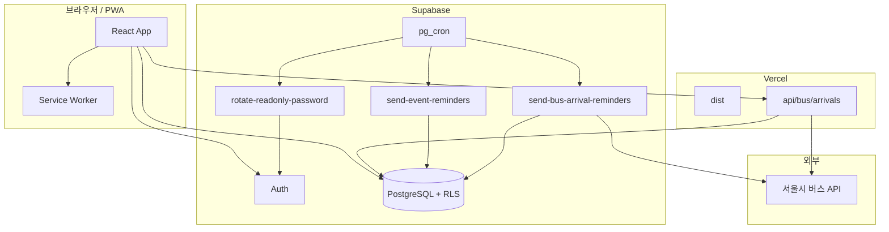

# 기능 개요

개인 대시보드 주요 기능 정리입니다. (2026-06 기준)

---

## 페이지 구성

| 경로 | 로그인 | readOnly2 | 설명 |
|------|--------|-----------|------|
| `/` | 불필요 | ✅ | About |
| `/home` | 필요 | ✅ | 홈 — 오늘 일정(개인만) |
| `/dashboard` | 필요 | ✅ | FullCalendar |
| `/ledger` | 필요 | ❌ | 가계부 |
| `/bus` | 불필요 | ❌ (메뉴 숨김) | 버스 도착 |
| `/login` | — | — | 이메일 또는 `readOnly` / `readOnly2` |

---

## 1. Web Push (백그라운드 일정 알림)

```
브라우저 구독 → push_subscriptions
pg_cron 5분 → send-event-reminders → Web Push
```

| 항목 | 값 |
|------|-----|
| Edge Function | `send-event-reminders` |
| Cron | **pg_cron** `send-push-reminders-5min` |
| 문서 | [web-push.md](./web-push.md) |

**알림 시각:** 종일 09:00 KST / 시간 일정 `starts_at`

---

## 2. 버스 도착 알림 (Web Push)

```
bus_alarm_settings + Push 구독
pg_cron 5분 → send-bus-arrival-reminders → Web Push
```

| 항목 | 값 |
|------|-----|
| Edge Function | `send-bus-arrival-reminders` |
| Cron | 일정과 동일 pg_cron Job |
| 문서 | [bus-arrival-alerts.md](./bus-arrival-alerts.md) |

Push 미구독 시 탭 열림 상태에서만 ~1분 폴링 폴백.

---

## 3. readOnly / readOnly2

| 계정 | 범위 | `readonly_scope` |
|------|------|------------------|
| readOnly | 전체 조회 | `full` |
| readOnly2 | 개인 일정만 | `personal_events` |

비밀번호: `Qkdzk!YYMM` (두 계정 동일, 매월 1일 자동 변경)

상세: [readonly-account.md](./readonly-account.md), [readonly-cron.md](./readonly-cron.md)

---

## 4. 버스 API 전역 일일 한도

서울시 API **1일 1,000회** — Vercel API + Edge Function이 **합산** 집계.

| DB | 역할 |
|----|------|
| `bus_api_daily_usage` | KST 날짜별 호출 횟수 |
| `reserve_bus_api_calls()` | 원자적 +1 |
| `get_bus_api_quota()` | 남은 횟수 |

**Vercel 필수:** `SUPABASE_URL`, `SUPABASE_SERVICE_ROLE_KEY`, `SEOUL_BUS_API_KEY`

---

## 5. 가계부 (Ledger)

- readOnly(full): 조회만
- readOnly2: 접근 불가 (RLS + UI)

---

## 아키텍처 요약



---

## Edge Function URL

| 함수 | URL |
|------|-----|
| 일정 알림 | `.../send-event-reminders` |
| 버스 도착 알림 | `.../send-bus-arrival-reminders` |
| readOnly 비밀번호 | `.../rotate-readonly-password` |

호출: `Authorization: Bearer <CRON_SECRET>` (+ `apikey` 권장)

---

## 주요 마이그레이션

| 파일 | 내용 |
|------|------|
| `20260629_ledger.sql` | 가계부 |
| `20260630_event_notify.sql` | 일정 알림 플래그 |
| `20260701_web_push.sql` | Push 구독·발송 기록 |
| `20260702_readonly_role.sql` | readOnly 역할·RLS |
| `20260703_bus_api_quota.sql` | 버스 API 일일 한도 |
| `20260704`–`20260705` | readOnly pg_cron + Vault |
| `20260706_bus_alarm_push.sql` | 버스 알림 설정·캐시 |
| `20260707_push_reminders_cron.sql` | 일정+버스 pg_cron 5분 |
| `20260708_readonly2_personal_events.sql` | readOnly2·RLS |

---

## 앞으로 해볼 만한 작업

| 우선순위 | 작업 |
|----------|------|
| 낮음 | 버스 실사용·도착 알림 E2E 검증 |
| 낮음 | 버스 한도 임박 알림 (owner) |
| 중간 | 가계부 월별 추이 차트 |
| 중간 | 일정 `.ics`보내기 |
| 낮음 | E2E 스모크 테스트 |
| 낮음 | readOnly 로그인 비밀번호 힌트 UI |

**운영 완료:** Vercel env, pg_cron(일정·버스·readOnly), readOnly2, cron-job.org 정리
