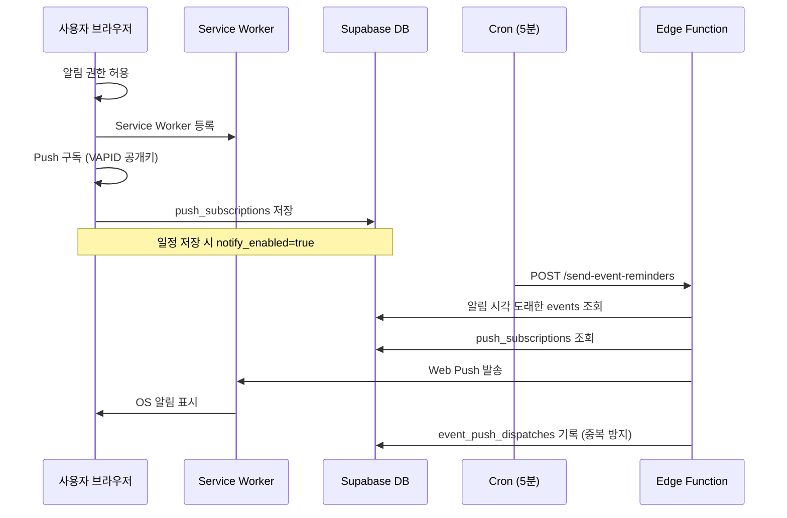

# Web Push 백그라운드 일정 알림

Dashboard 일정 알림을 **탭이 꺼져 있어도** OS 알림으로 받기 위한 Web Push 구현 정리입니다.  
Google/Apple 캘린더 연동(`.ics`) 없이, 브라우저 표준 Push API + Supabase Edge Function으로 동작합니다.

---

## 개요

| 방식 | 탭 열림 | 탭 닫힘 | 비용 |
|------|---------|---------|------|
| 기존 `useEventNotifications` | ✅ | ❌ | 무료 |
| **Web Push (본 문서)** | ✅ (SW 경유) | ✅ | 무료 |

Web Push가 **구독된 상태**이면 클라이언트 `setTimeout` 알림은 자동으로 비활성화되어 중복 알림을 막습니다.

---

## 동작 흐름



### 알림 시각 규칙

- **종일 일정**: 해당 날짜 **09:00 (Asia/Seoul)**
- **시간 일정**: `starts_at` 시각
- Edge Function은 **최근 5분** 창 안에 들어온 일정만 발송합니다.

---

## 추가·변경된 파일

### 프론트엔드

| 경로 | 역할 |
|------|------|
| `public/sw.js` | Push 수신, `showNotification`, 클릭 시 Dashboard 포커스 |
| `public/manifest.json` | PWA 메타 (홈 화면 추가 시 안정성) |
| `src/utils/webPush.ts` | SW 등록, Push 구독/해제, VAPID 키 처리 |
| `src/services/supabasePushService.ts` | 구독 정보 Supabase 저장/삭제 |
| `src/hooks/useWebPush.ts` | 구독 상태 관리 훅 |
| `src/hooks/useEventNotifications.ts` | Web Push 구독 시 탭 전용 알림 비활성화 |
| `src/components/calendar/EventNotificationBanner.tsx` | 「백그라운드 알림 켜기/끄기」 UI |

### Supabase

| 경로 | 역할 |
|------|------|
| `supabase/migrations/20260701_web_push.sql` | Push 관련 테이블·함수 |
| `supabase/migrations/20260630_event_notify.sql` | `events.notify_enabled` 컬럼 (선행 필요) |
| `supabase/functions/send-event-reminders/index.ts` | 서버 측 Push 발송 |
| `supabase/config.toml` | `verify_jwt = false` (cron 호출용) |
| `supabase/schema.sql` | 전체 스키마에 Web Push 섹션 반영 |

### 기타

| 경로 | 역할 |
|------|------|
| `scripts/generate-vapid-keys.mjs` | VAPID 키 생성 |
| `.env.example` | 환경 변수 예시 |
| `index.html` | `manifest.json` 링크 |

---

## DB 스키마

### `push_subscriptions`

사용자별 브라우저 Push 구독 정보.

| 컬럼 | 설명 |
|------|------|
| `user_id` | `auth.users` FK |
| `endpoint` | Push 서비스 URL |
| `p256dh`, `auth_key` | 암호화 키 |
| `user_agent` | 등록 시 브라우저 정보 |

### `event_push_dispatches`

동일 일정·동일 시각 중복 발송 방지.

| 컬럼 | 설명 |
|------|------|
| `event_id` | 일정 ID |
| `notify_at` | 발송 기준 시각 |
| `sent_at` | 실제 발송 시각 |

### `event_notify_at()` 함수

종일/시간 일정의 알림 시각을 SQL에서 계산합니다 (기본 타임존: `Asia/Seoul`).

---

## 설정 가이드

### 1. DB 마이그레이션

Supabase Dashboard → **SQL Editor**에서 순서대로 실행:

1. `supabase/migrations/20260630_event_notify.sql` (미실행 시)
2. `supabase/migrations/20260701_web_push.sql`

### 2. VAPID 키 생성

```bash
npm run vapid:generate
```

출력된 값을 환경 변수에 등록합니다.

#### 프론트엔드 (`.env`, Vercel)

```env
VITE_VAPID_PUBLIC_KEY=공개키
```

> `VAPID_PRIVATE_KEY`는 **프론트에 넣지 마세요.**

#### Edge Function 시크릿 (Supabase 서버 전용)

```bash
supabase secrets set VAPID_PUBLIC_KEY=공개키
supabase secrets set VAPID_PRIVATE_KEY=비밀키
supabase secrets set VAPID_SUBJECT=mailto:your-email@example.com
supabase secrets set CRON_SECRET=긴_랜덤_문자열
```

`SUPABASE_URL`, `SUPABASE_SERVICE_ROLE_KEY`는 Edge Function에 자동 주입됩니다.

### 3. Edge Function 배포

```bash
supabase login
supabase link --project-ref <프로젝트-ref>
supabase functions deploy send-event-reminders
```

배포 성공 시 예시 메시지:

```
Deployed Functions on project <ref>: send-event-reminders
```

`WARNING: Docker is not running`은 **로컬 테스트용** 경고이며, 클라우드 배포 성공과 무관합니다.

배포 후 함수 URL:

```
https://<프로젝트-ref>.supabase.co/functions/v1/send-event-reminders
```

### 4. Cron 설정 (필수)

Edge Function은 **호출될 때만** 동작합니다. **5분마다** POST가 필요합니다.

**권장: Supabase pg_cron** (레포에 포함)

마이그레이션 `20260707_push_reminders_cron.sql` 적용 후:

```sql
select jobname, schedule, active from cron.job
where jobname = 'send-push-reminders-5min';
```

이 Job이 `send-event-reminders`와 `send-bus-arrival-reminders`를 **한 번에** 호출합니다.

**사전 준비:** `supabase/scripts/setup-readonly-cron.sql` 로 Vault에 `cron_secret`, `supabase_anon_key` 등록

**수동 호출 예:**

```http
POST https://<프로젝트-ref>.supabase.co/functions/v1/send-event-reminders
Authorization: Bearer <CRON_SECRET>
apikey: <VITE_SUPABASE_ANON_KEY>
```

> **cron-job.org는 더 이상 사용하지 않습니다.** 예전 Job이 남아 있으면 알림이 중복될 수 있습니다.

**대안:** Supabase Dashboard → Edge Functions → Schedules (플랜 지원 시)

### 5. 앱에서 구독 활성화

1. Dashboard 접속 (Supabase 로그인 필요)
2. 알림이 켜진 일정이 있으면 **「백그라운드 알림 켜기」** 배너 표시
3. 브라우저 알림 권한 허용
4. 구독 정보가 `push_subscriptions`에 저장됨

모바일에서는 **홈 화면에 추가(PWA)** 시 알림이 더 안정적입니다.

---

## 동작 확인

### Edge Function 수동 호출

PowerShell:

```powershell
curl.exe -X POST "https://<프로젝트-ref>.supabase.co/functions/v1/send-event-reminders" `
  -H "Authorization: Bearer <CRON_SECRET>"
```

**정상 응답 예시 (HTTP 200)**

```json
{"checked":1,"due":0,"sent":0,"failed":0,"cleaned":0}
```

| 필드 | 의미 |
|------|------|
| `checked` | `notify_enabled=true`인 일정 수 |
| `due` | 최근 5분 창에 들어온 발송 대상 수 |
| `sent` | 성공한 Push 발송 수 |
| `failed` | 발송 실패 수 |
| `cleaned` | 만료된 구독 정리 수 |

### 엔드투엔드 테스트

1. Dashboard에서 **백그라운드 알림 켜기**
2. 알림 ON 일정 생성 — 시작 시각을 **1~2분 뒤**로 설정
3. 탭 닫기
4. Cron이 돌아간 뒤 OS 알림 수신 확인

---

## 오류 대응

| 증상 | 원인 | 조치 |
|------|------|------|
| `401 Unauthorized` | `CRON_SECRET` 불일치 | Secrets · Vault · pg_cron 함수 확인 |
| `500 Missing server configuration` | VAPID 시크릿 누락 | 4개 시크릿 모두 등록 확인 |
| `notify_enabled` 저장 오류 | 마이그레이션 미실행 | `20260630_event_notify.sql` 실행 |
| Push 구독 저장 오류 | Push 테이블 없음 | `20260701_web_push.sql` 실행 |
| `checked>0`, `due=0`, `sent=0` | 발송 시각 아직 안 됨 | 정상 — 알림 시각 + cron 주기 확인 |
| `due>0`, `sent=0` | 구독 없음 | Dashboard에서 백그라운드 알림 켜기 |
| 탭 열릴 때만 알림 | Web Push 미설정 | `VITE_VAPID_PUBLIC_KEY` + 마이그레이션 + 구독 |
| Docker 경고 | 로컬 SW 미사용 | 배포에는 영향 없음, 무시 가능 |

---

## 환경 변수 요약

| 변수 | 위치 | 용도 |
|------|------|------|
| `VITE_VAPID_PUBLIC_KEY` | `.env`, Vercel | 브라우저 Push 구독 |
| `VAPID_PUBLIC_KEY` | Supabase Secrets | Edge Function 발송 |
| `VAPID_PRIVATE_KEY` | Supabase Secrets | Edge Function 발송 |
| `VAPID_SUBJECT` | Supabase Secrets | `mailto:...` 형식 |
| `CRON_SECRET` | Supabase Secrets + cron | 함수 호출 인증 |

---

## 보안 참고

- `CRON_SECRET`, `VAPID_PRIVATE_KEY`는 외부에 노출하지 마세요.
- 채팅·로그 등에 시크릿이 노출되면 `supabase secrets set`으로 **재발급**하고 Vault를 갱신하세요.
- `event_push_dispatches`는 RLS로 클라이언트 접근을 차단하고, Edge Function만 service role로 기록합니다.

---

## 관련 문서

- [Web Push 테스트 시나리오](./web-push-test-scenarios.md)
- [Web Push API (MDN)](https://developer.mozilla.org/en-US/docs/Web/API/Push_API)
- [Supabase Edge Functions](https://supabase.com/docs/guides/functions)
- [Supabase CLI](https://supabase.com/docs/guides/cli)
